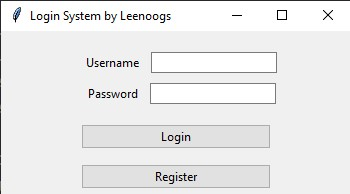
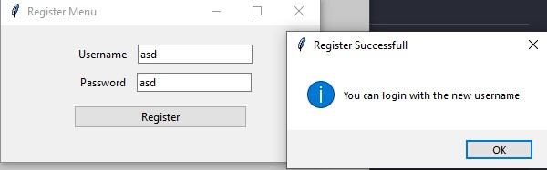
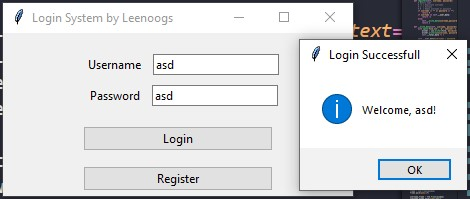

# Simple Login GUI with Tkinter

## Preview




## Prerequisites
- Python 3.x.x
- Clone this repository

## How to run
```bash
python .\122140079_cornelius_linux_Pset{1}.py
```

## Note
This system has auto save system, so if you register your data will be saved in file.csv. Don't worry, it use local storage :)